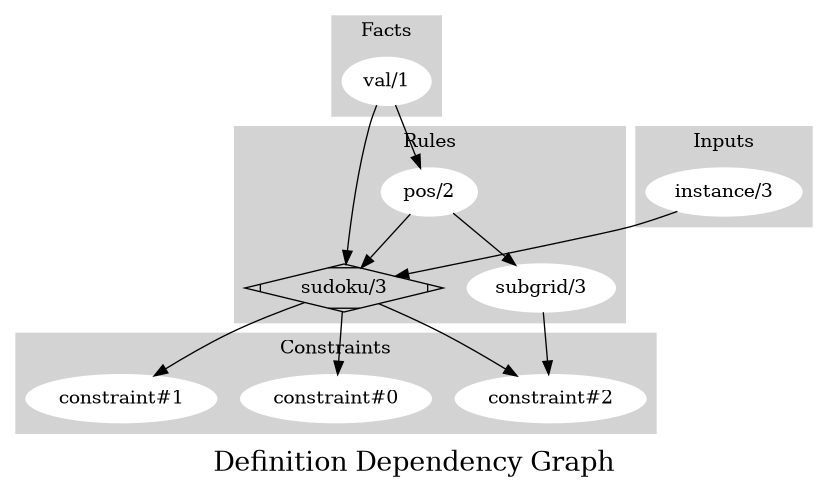
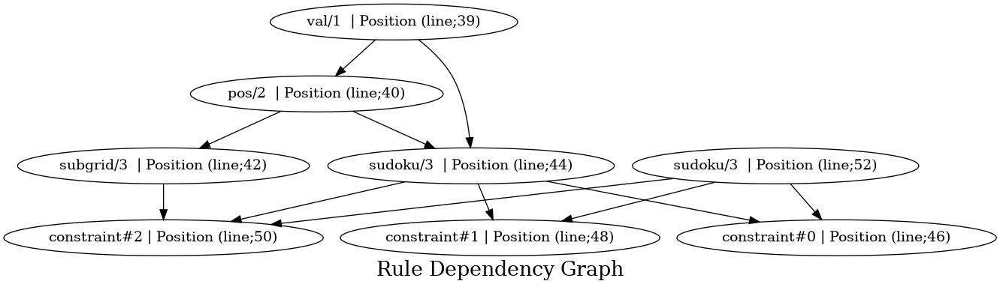

# User documentation
# SUDOKU
## Description 
Sudoku solver. Takes as input *instance* predicates, it also takes as option *dim* representing the dimension of the sudoku grid. *instance* predicates represent a value of cell at a given position. The solver will always return a solution if a solution exist
## Usage 
```bash 
clingo sudoku.lp [instance] [-c dim=3] 
```
## Example  
 ```prolog
instance(1,1,1). instance(2,2,2).
```
## Dependencies 
None
## Background 
https://en.wikipedia.org/wiki/Sudoku
### Dev 
https://github.com/...
##Author(s) 
Uni-Potsdam


# Contributor documentation
## Inputs
Showing all inputs 

| **Signature** | **Location** | **Doc** |
|---------------|--------------|---------|
| instance/3 | Line; 34 | [] |

## Facts
Showing all facts

| **Signature** | **Location** | **Doc** |
|---------------|--------------|---------|
| val/1 | Line; 39 | [] |

## Rules
Showing all rules

| **Signature** | **Depends** | **Location** | **Doc** |
|---------------|-------------|--------------|---------|
| pos/2 | val/1 | Line; 40 | [] |
| subgrid/3 | pos/2 | Line; 42 | [' `subgrid(X,Y,S)` The cell (`X`, `Y`) is in subgrid `S`'] |
| sudoku/3 | val/1 pos/2 | Line; 44 | [' `sudoku(X,Y,V)` The cell (`X`, `Y`) has value `V` with `0<V<=dim*dim`'] |
| sudoku/3 | instance/3 | Line; 52 | [] |

## Constraints
Showing all constraints 

| **Signature** | **Dependencies** | **Location** | **Doc** |
|---------------|------------------|--------------|---------|
| constraint#0 | sudoku/3 | Line; 46 | [" Can't repeat values per row"] |
| constraint#1 | sudoku/3 | Line; 48 | [" Can't repeat values per column"] |
| constraint#2 | subgrid/3 sudoku/3 | Line; 50 | [" Can't repeat values per subgrid"] |

## Outputs
Showing all outputs 

| **Signature** | **Location** | **Doc** |
|---------------|--------------|---------|
| sudoku/3 | Line; 61 | [] |



