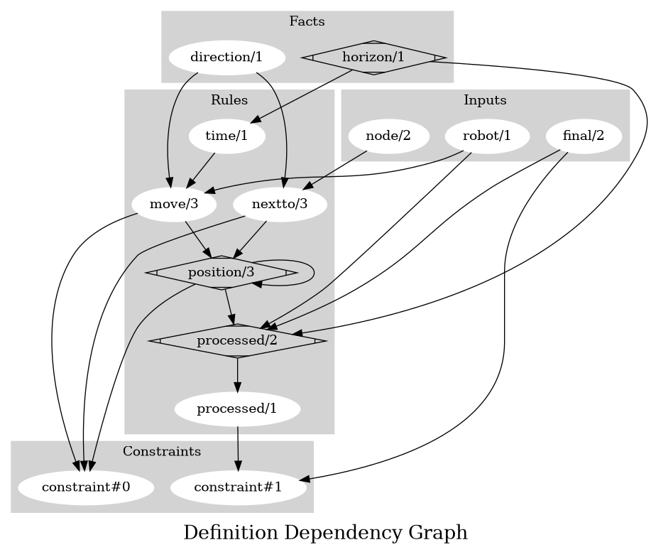
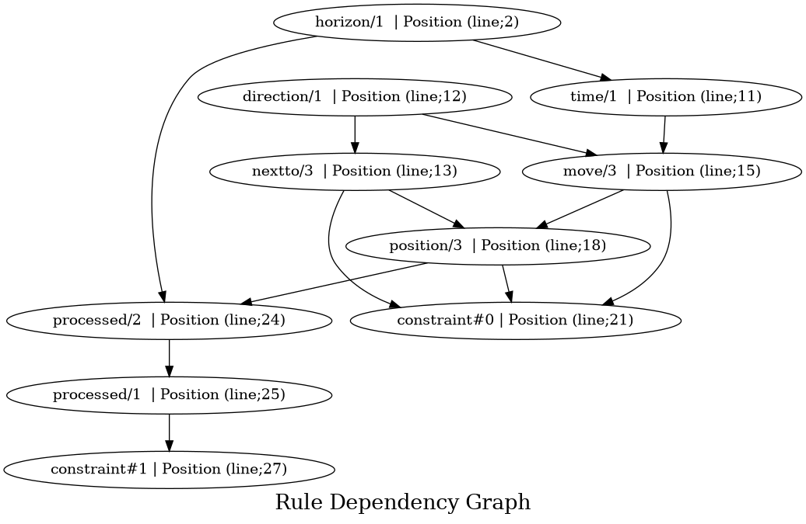

# Contributor documentation
## Facts
Showing all facts

| **Signature** | **Location** | **Doc** |
|---------------|--------------|---------|
| horizon/1 | Line; 2 | [] |
| direction/1 | Line; 12 | [] |

## Inputs
Showing all inputs 

| **Signature** | **Location** | **Doc** |
|---------------|--------------|---------|
| node/2 | Line; 5 | [' Nodes of the graph'] |
| robot/1 | Line; 7 | [' Robots of the mapf problem'] |
| final/2 | Line; 9 | [' Assign the final position to a robot'] |

## Rules
Showing all rules

| **Signature** | **Depends** | **Location** | **Doc** |
|---------------|-------------|--------------|---------|
| time/1 | horizon/1 | Line; 11 | [] |
| nextto/3 | direction/1 node/2 | Line; 13 | [] |
| move/3 | robot/1 direction/1 time/1 | Line; 15 | [] |
| position/3 | move/3 nextto/3 position/3 | Line; 18 | [' Recursively generate position for each step'] |
| processed/2 | robot/1 final/2 position/3 horizon/1 | Line; 24 | [' Check if robot reach its goal'] |
| processed/1 | processed/2 | Line; 25 | [] |

## Constraints
Showing all constraints 

| **Signature** | **Dependencies** | **Location** | **Doc** |
|---------------|------------------|--------------|---------|
| constraint#0 | move/3 nextto/3 position/3 | Line; 21 | [' it is not possible to move to a NOT neighboring node'] |
| constraint#1 | processed/1 final/2 | Line; 27 | [' it is not possible that a robot did not reached its goal'] |

## Outputs
Showing all outputs 

| **Signature** | **Location** | **Doc** |
|---------------|--------------|---------|
| position/3 | Line; 29 | [] |
| horizon/1 | Line; 30 | [] |
| processed/2 | Line; 31 | [] |

