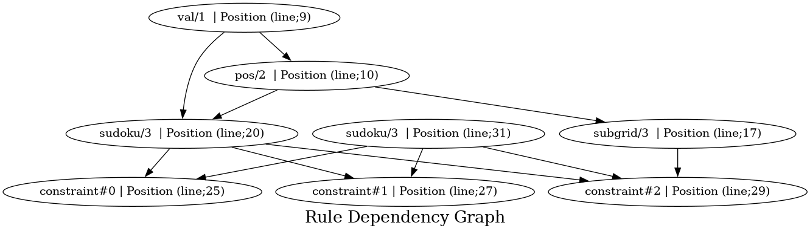

# Contributor documentation
## Section : "Input"
## Inputs
Showing all inputs 

| **Signature** | **Location** | **Doc** |
|---------------|--------------|---------|
| instance/3 | Line; 5 | ['-- `instance(X,Y,V)` The cell (`X`, `Y`) has an initial value of `V`\n'] |

## Facts
Showing all facts

| **Signature** | **Location** | **Doc** |
|---------------|--------------|---------|
| val/1 | Line; 9 | ['-- The dimension of the Sudoku: `dim*dim x dim*dim grid\n'] |

## Rules
Showing all rules

| **Signature** | **Depends** | **Location** | **Doc** |
|---------------|-------------|--------------|---------|
| pos/2 | val/1 | Line; 10 | ['-- The dimension of the Sudoku: `dim*dim x dim*dim grid\n'] |

## Section : "Rules"
## Rules
Showing all rules

| **Signature** | **Depends** | **Location** | **Doc** |
|---------------|-------------|--------------|---------|
| subgrid/3 | pos/2 | Line; 17 | [' `subgrid(X,Y,S)` The cell (`X`, `Y`) is in subgrid `S`\n'] |
| sudoku/3 | pos/2 val/1 | Line; 20 | [' `sudoku(X,Y,V)` The cell (`X`, `Y`) has value `V` with `0<V<=dim*dim`\n'] |

## Section : "Constraint"
## Constraints
Showing all constraints 

| **Signature** | **Dependencies** | **Location** | **Doc** |
|---------------|------------------|--------------|---------|
| constraint#0 | sudoku/3 | Line; 25 | [" Can't repeat values per row\n"] |
| constraint#1 | sudoku/3 | Line; 27 | [" Can't repeat values per row\n", " Can't repeat values per column\n"] |
| constraint#2 | subgrid/3 sudoku/3 | Line; 29 | [" Can't repeat values per row\n", " Can't repeat values per column\n", " Can't repeat values per subgrid\n"] |

## Rules
Showing all rules

| **Signature** | **Depends** | **Location** | **Doc** |
|---------------|-------------|--------------|---------|
| sudoku/3 | instance/3 | Line; 31 | [] |

## Outputs
Showing all outputs 

| **Signature** | **Location** | **Doc** |
|---------------|--------------|---------|
| sudoku/3 | Line; 33 | [] |

