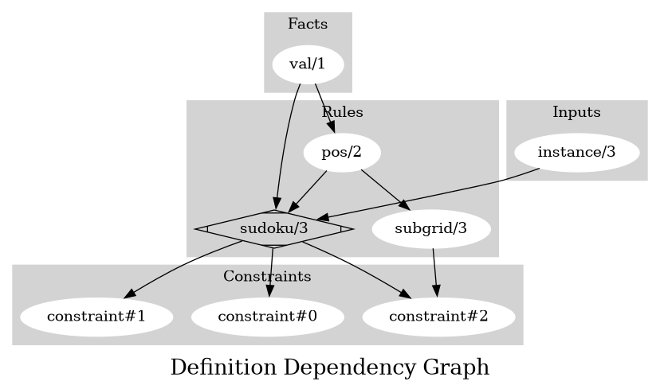
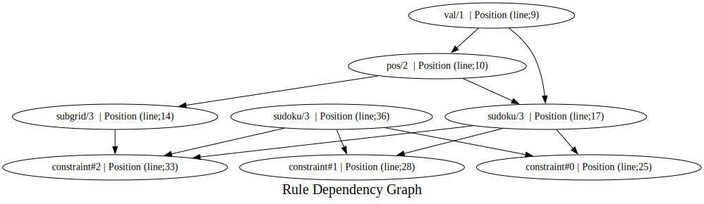

# Contributor documentation
## Section : Constraints

| **Signature** | **Dependencies** | **Location** | **Doc** |
|---------------|------------------|--------------|---------|
| constraint#0 | sudoku/3 | [Line; 25](https://github.com/Owrel/clindoc/blob/master/examples/sudoku_without_user_doc.lp#L25) | [] |
| constraint#1 | sudoku/3 | [Line; 28](https://github.com/Owrel/clindoc/blob/master/examples/sudoku_without_user_doc.lp#L28) | [] |
| constraint#2 | subgrid/3 sudoku/3 | [Line; 33](https://github.com/Owrel/clindoc/blob/master/examples/sudoku_without_user_doc.lp#L33) | [] |

## Section : Input

| **Signature** | **Location** | **Doc** |
|---------------|--------------|---------|
| instance/3 | [Line; 5](https://github.com/Owrel/clindoc/blob/master/examples/sudoku_without_user_doc.lp#L5) | [] |

| **Signature** | **Location** | **Doc** |
|---------------|--------------|---------|
| val/1 | [Line; 9](https://github.com/Owrel/clindoc/blob/master/examples/sudoku_without_user_doc.lp#L9) | [] |

| **Signature** | **Depends** | **Location** | **Doc** |
|---------------|-------------|--------------|---------|
| pos/2 | val/1 | [Line; 10](https://github.com/Owrel/clindoc/blob/master/examples/sudoku_without_user_doc.lp#L10) | [] |

## Section : Translation & Output

| **Signature** | **Depends** | **Location** | **Doc** |
|---------------|-------------|--------------|---------|
| sudoku/3 | instance/3 | [Line; 36](https://github.com/Owrel/clindoc/blob/master/examples/sudoku_without_user_doc.lp#L36) | [] |

| **Signature** | **Location** | **Doc** |
|---------------|--------------|---------|
| sudoku/3 | [Line; 38](https://github.com/Owrel/clindoc/blob/master/examples/sudoku_without_user_doc.lp#L38) | [] |

## Section : Rules

| **Signature** | **Depends** | **Location** | **Doc** |
|---------------|-------------|--------------|---------|
| subgrid/3 | pos/2 | [Line; 14](https://github.com/Owrel/clindoc/blob/master/examples/sudoku_without_user_doc.lp#L14) | ['`subgrid(X,Y,S)` The cell (`X`, `Y`) is in subgrid `S`'] |
| sudoku/3 | pos/2 val/1 | [Line; 17](https://github.com/Owrel/clindoc/blob/master/examples/sudoku_without_user_doc.lp#L17) | [] |

